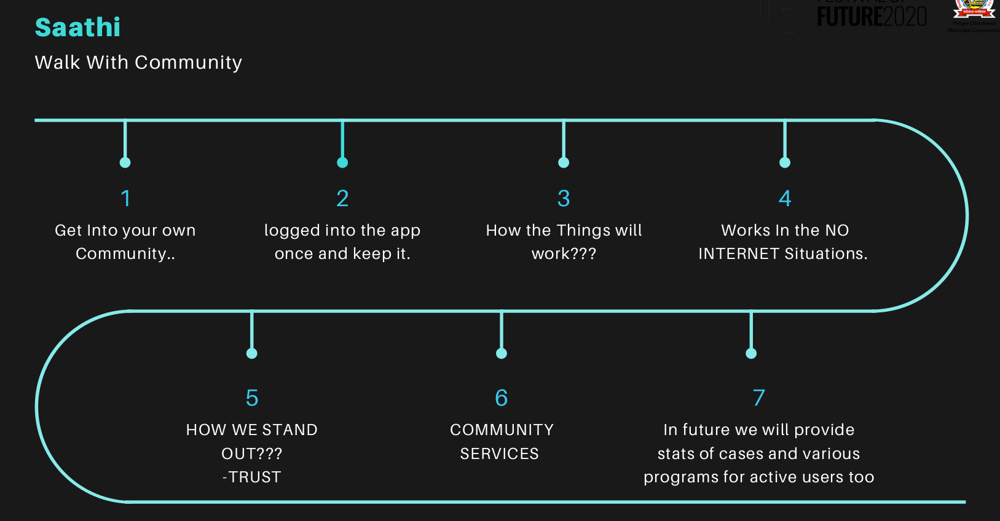
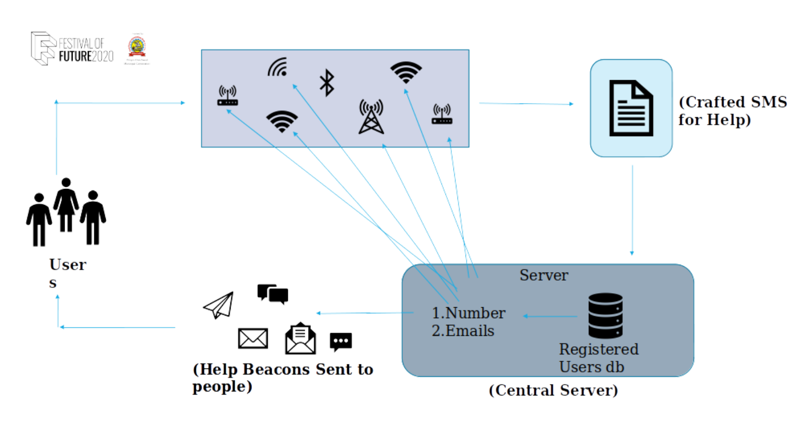
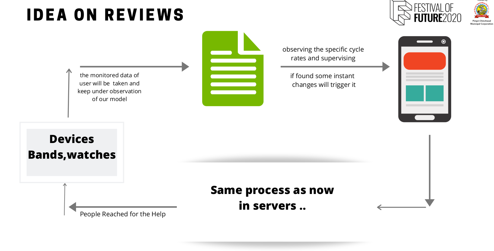
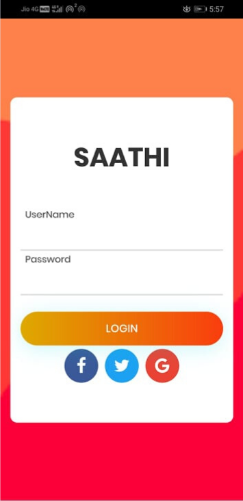

# Festival-of-Future-Hackathon

## Present Solution in Market

 1. Sending sms to helpline/Emergency saved Contacts.

 2. Apps with more additional features requires internet.

## Our Solution

 1. Sending sms to people who can react to the situation faster. That is to the ones who are near to the location and can arrive for help.

 2. This can be done by fetching the location of nearby people's through GPS and  mac addresses.

 3. Adequate amount of data about the victim is sent without the use of internet to the near ones!!!

 4. WE sending sos messages in every worst cases like if the victim does't have network then also we are able to send sms.

### How our idea works

### Architecture

##Now This whole thing we build in just 30hrs

# Future Idea

# Login Page

### Team Members
<a href="https://github.com/todecypher">Satyajit Singh</a>
 
<a href="https://github.com/satya9500">Satya Prakash</a>
 
<a href="https://github.com/flarsu">Rishav Sharma</a>
 
<a href="https://github.com/AkshaySharma008">Akshay Sharma</a>
 
